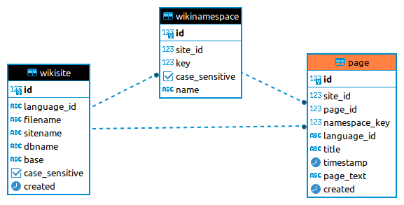

# wiktionary
Doing Wiktionary things

## Scripts

* `parse-wiktionary.py`

SAX-based XML parser for Wiktionary dumps

See [Parsing Wiktionary XML dumps](https://linglangchang.wordpress.com/2023/01/29/parsing-wiktionary-xml-dumps/)

* `postgresql_v1`

Import Wiktionary dump into PostgreSQL database (single table)

See [Importing Wiktionary XML dumps into PostgreSQL database](https://linglangchang.wordpress.com/2023/02/04/importing-wiktionary-xml-dumps-into-postgresql-database/)

* `postgresql_v2`

Import Wiktionary dump into PostgreSQL database (sites and namespaces)

See [Importing Wiktionary XML dumps into PostgreSQL database, again](https://linglangchang.wordpress.com/2023/02/06/importing-wiktionary-xml-dumps-into-postgresql-database-again/)

* `extract-reconstruction.sh`

Extract reconstructed languages from en.wiktionary dump
